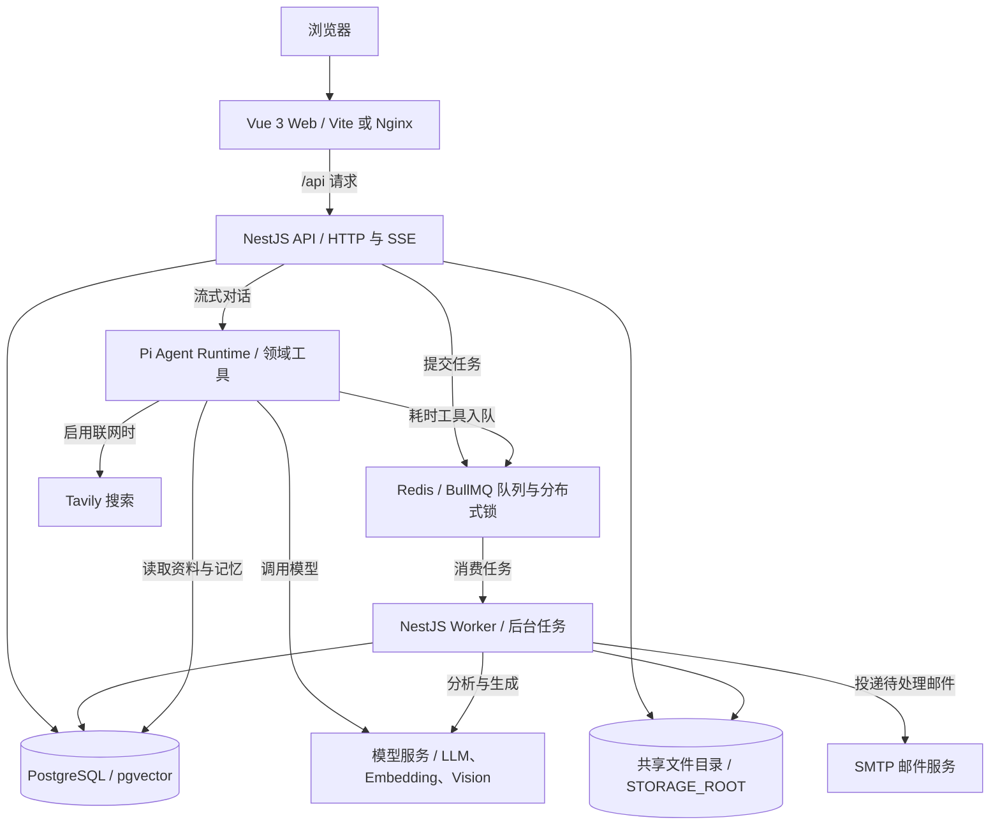
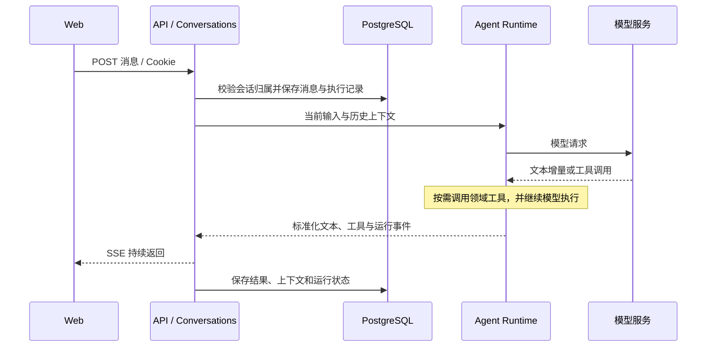

# NBBOSS AI 外脑

面向内部协作的多用户 AI 工作台，提供流式会话、PDF 知识问答、会议分析、待办管理、长期记忆、PPT 生成与编辑，以及账号操作日志。

本文以当前仓库实现为准。项目采用 pnpm workspace 管理前端、后端与共享协议；后端按业务组织代码，以 API 和 Worker 两种进程运行，共用数据库、任务队列和文件存储。

## 1. 整体架构



- **Web** 负责页面交互、表单编辑、流式展示和后台产物状态刷新。开发环境使用 Vite，Docker 环境由 Nginx 提供静态资源并代理 `/api`。
- **API** 负责身份校验、资源归属检查、业务读写、对话执行与任务提交。聊天流在 API 进程中执行，后台耗时任务交给 Worker。
- **Worker** 与 API 复用同一套服务代码，设置 `WORKER_MODE=true` 后创建 NestJS 应用上下文，不启动 HTTP 监听。它消费 BullMQ 任务，并定时处理邮件和检查中断任务。
- **PostgreSQL** 保存业务状态、会话上下文和执行记录；**Redis** 保存队列、短期锁及 Worker 心跳；**文件目录**保存上传原件与导出的 PPTX。

代码启动入口为 [main.ts](apps/api/src/main.ts)，服务注册集中在 [app.module.ts](apps/api/src/app.module.ts)。业务目录中的控制器与服务由这个应用模块统一装配。

## 2. 技术组成

| 层次 | 当前实现 | 用途 |
| --- | --- | --- |
| 前端 | Vue 3、TypeScript、Vite、Vue Router、Pinia | 页面、路由、登录与交互状态 |
| HTTP 服务 | NestJS、Express、JWT、Argon2 | 接口、认证、密码哈希 |
| Agent | Pi Agent Core、Pi AI、TypeBox | 模型适配、工具调用、执行事件 |
| 数据与校验 | PostgreSQL 16、pgvector、Prisma、Zod | 数据持久化、迁移、输入与结构化结果校验 |
| 后台执行 | Redis、BullMQ | 异步任务、重试、去重与锁 |
| 文件处理 | pdfjs-dist、Tesseract.js、PptxGenJS | PDF 提取、本地 OCR、PPTX 导出 |
| 外部服务 | OpenAI-compatible 模型、Tavily、SMTP | 模型推理、可选搜索和邮件 |
| 验证与部署 | Vitest、Supertest、Playwright、Docker Compose | 单元、接口、页面测试与运行环境 |

依赖版本以各包的 `package.json` 和根目录 `pnpm-lock.yaml` 为准。

## 3. 目录与代码职责

```text
apps/
  api/
    src/
      main.ts                 API / Worker 启动分支
      app.module.ts           依赖注入与服务注册
      common/                 当前用户、异常处理、请求与活动日志
      infra/                  Prisma、Redis、任务提交与消费
      modules/                按业务组织的控制器与服务
    prisma/                   数据模型和增量迁移
    test/                     后端单元与集成测试
  web/
    src/
      views/                  会话、登录、待办、记忆、PPT、日志页面
      components/             共享界面组件
      stores/                 前端状态
      api.ts                  HTTP、认证续期与 SSE 读取
      router.ts               页面路由
      styles.css              界面样式
packages/contracts/           前后端共享 Schema、类型与事件协议
e2e/                          页面测试、Playwright 配置及示例材料
scripts/windows/              本机安装、启动、停止与服务配置
doc/                          部署、接口、用户操作等详细说明
docker/                       容器初始化配置
```

前端的路由登录判断用于页面导航，实际接口权限由后端认证和资源归属检查决定。`api.ts` 携带 Cookie 请求接口，在访问凭证过期时尝试刷新；SSE 通过 `fetch` 响应流读取。前端使用共享协议包约束部分业务类型，后端对输入和模型结构化输出进行校验。

## 4. 后端业务模块

模块代码位于 [apps/api/src/modules](apps/api/src/modules)。

| 模块 | 主要职责 | 主要协作对象 |
| --- | --- | --- |
| `auth` | 注册、登录、刷新、退出和修改密码；签发 HttpOnly Cookie | User、RefreshToken |
| `conversations` | 会话、消息、执行状态与流式接口 | AgentRuntimePort、任务服务 |
| `agent` | 恢复模型上下文、模型适配、工具执行与事件转换 | 检索、记忆、会议、PPT、搜索 |
| `files` | 上传、解析、OCR、分块和会话内检索 | 文件目录、Worker、Embedding |
| `meetings` | 会议分组、证据风险、重分析及待办关联 | 文件、模型、待办、邮件 |
| `todos` | 待办筛选、编辑和状态变更 | 会议风险与人工修改字段 |
| `memories` | 记忆抽取、检索、历史版本与人工修正 | 会话、会议、抽取任务 |
| `presentations` | PPT 后台生成、事实校验、编辑版本与下载 | 模型、任务队列、文件目录 |
| `search` | 可选联网检索与来源信息 | Tavily、SearchRun |
| `mail` | 持久化投递记录、重试与当前内容核对 | EmailDelivery、SMTP |
| `logs` | 按账号查询日志、游标分页与过期清理 | ActivityLog、统一日志写入器 |

Agent 通过 `AgentRuntimePort` 接入会话层，将 Pi 的执行事件转换为项目内部协议。工具包括资料检索、记忆检索、当前会议读取、联网搜索、会议分析和 PPT 生成；工具层处理资源范围、功能开关及执行额度，领域服务负责最终校验和写入。

## 5. 关键业务数据流

### 5.1 流式对话



用户可见消息与模型使用的工具上下文保存在数据库中，恢复会话时从数据库读取。页面识别完成、失败和中止等终止事件；连接意外结束时提示核对后台状态，避免直接重复发送。

### 5.2 文件与知识问答

上传文件后，API 保存原件及 `FileAsset`，提交 `file.parse`。Worker 提取 PDF 文本，对需要的页面执行 OCR，保存页码、页面内容和分块；TXT 可作为会议分析材料。

问答检索限定当前账号与当前会话的可用 PDF。默认使用 BM25；配置 Embedding 后增加 pgvector 语义检索，以 RRF 合并排名。Embedding 不可用或调用失败时回退到文本检索。结果携带文件名、页码和证据文本，供回答引用。OCR 和模型输出仍需结合原文核对。

### 5.3 会议、待办与邮件

会议模式的文件解析完成后，任务服务通过防抖合并同批上传，提交 `meeting.analyze`。Worker 读取材料，识别会议、风险和原文证据，保存 `Meeting`、`Risk`、`Todo` 等记录。重分析会处理旧风险与来源变化，并保留人工修改及完成状态。

邮件使用数据库中的 `EmailDelivery` 记录，由 Worker 定时投递，独立于四类 BullMQ 业务任务。投递前核对当前有效内容；未配置 SMTP 不阻止会议与待办生成。SMTP 接受请求并不等同于最终收件，结果不确定时需要先核对邮箱。

### 5.4 长期记忆

会话或会议内容触发抽取时，先持久化 `MemoryExtraction`，再提交 `memory.extract`。Worker 提取实体与事实，保存来源、观察时间、历史版本和人工修正标记。后续对话可检索同一账号的跨会话记忆；删除来源或重分析时同步处理相关自动记忆。

### 5.5 PPT 生成与编辑

生成请求创建 `Presentation` 并提交 `presentation.generate`。Worker 基于输入及相关材料生成结构化幻灯片、核对事实并导出 PPTX，前端刷新任务状态。用户在编辑页调整内容，保存为新的 `PresentationVersion`；版本保存使用锁协调，下载对应版本的导出文件。

## 6. 数据与存储边界

数据库定义见 [schema.prisma](apps/api/prisma/schema.prisma)，结构变更通过 [迁移目录](apps/api/prisma/migrations)维护。

| 数据域 | 核心模型 | 保存内容 |
| --- | --- | --- |
| 身份 | User、RefreshToken | 账号、密码哈希和刷新凭证记录 |
| 会话执行 | Conversation、Message、AgentRun、AgentEvent、ToolExecution | 消息、模型上下文、事件、工具与用量 |
| 文件知识 | FileAsset、DocumentPage、DocumentChunk | 原件元数据、页面、分块及可选向量 |
| 会议行动 | Meeting、MeetingDocument、Risk、Todo、EmailDelivery | 会议来源、证据、待办和邮件状态 |
| 长期记忆 | MemoryExtraction、MemoryEntity、MemoryFact | 抽取任务、实体、事实与版本关系 |
| 搜索 | SearchRun | 查询、检索时间与来源 |
| PPT | Presentation、PresentationVersion | 生成状态、幻灯片 JSON 和版本产物 |
| 日志 | ActivityLog | 账号、操作、级别、参考编号及受限元数据 |

用户资源通过 `userId` 或父级会话关系隔离。数据库约束还校验部分冗余用户字段与跨会话关联，不能仅依赖前端传入的资源 ID。文件二进制不存入 PostgreSQL，API 与 Worker 必须访问同一个 `STORAGE_ROOT`。

## 7. 任务可靠性与日志

BullMQ 队列名为 `nbboss`，消费 `file.parse`、`meeting.analyze`、`memory.extract`、`presentation.generate`。任务按类型设置重试策略；无效输入等确定性错误停止重试，临时服务错误有限重试。任务 ID、防抖、领域缓存键和锁共同减少重复处理。

Worker 写入 Redis 心跳，定期检查长期未完成且已无有效队列任务的记录，将其标为可重试的失败状态。业务状态以数据库为准，队列存在不代表业务成功；进程中断和外部服务失败仍需通过任务状态及日志定位。

- `/api/health/live`：API 存活。
- `/api/health/ready`：检查 PostgreSQL 和 Redis，并返回 Worker 心跳状态；Worker 离线不直接使此接口返回失败。
- `/api/health/system`：同时检查数据库、Redis 和 Worker 心跳，后台任务不可用时返回 503。
- `/api/health/capabilities`：报告搜索、邮件、OCR、Embedding、Vision 等配置能力，不代表外部服务实时连通状态。
- 日志中心按当前账号查询 ActivityLog，默认保留 30 天，由 `LOG_RETENTION_DAYS` 控制；导出范围为当前页。
- 原始服务日志保存在 `.local/logs/`，与页面日志分开管理。日志写入限制元数据，不记录密码、令牌及用户正文。

## 8. 运行与部署

| 方式 | Web | API / Worker | 数据与文件 |
| --- | --- | --- | --- |
| Windows 本机 | Vite，默认 3000 | 独立 Node 进程；API 默认 3001 | 本地 PostgreSQL、Redis 与上传目录 |
| Docker Compose | Nginx，宿主机默认 3000 | 同一 API 镜像分别运行两个服务 | PostgreSQL 命名卷；API/Worker 共享上传卷 |

Compose 已为 Redis 启用 AOF 和持久化卷，各服务配置自动重启，默认端口仅绑定本机。项目提供数据库与文件的备份恢复脚本、启动配置校验、注册开关和请求/上传限额；部署到公网时仍需配置 TLS、独立数据库凭据和实际容量预算，见[部署说明](doc/deployment.md)。

Windows 安装 Node.js 24、pnpm 11.22.0 和 Visual Studio C++ 构建工具后，在根目录运行：

```powershell
.\start.cmd setup       # 首次安装环境
.\start.cmd configure   # 配置邮件与搜索，可选
.\start.cmd start       # 启动
.\start.cmd stop        # 停止并保留数据
```

双击 `start.cmd` 可打开管理菜单。模型服务需另按部署文档配置 `LLM_BASE_URL`、`LLM_API_KEY`、`LLM_MODEL` 并开启 `LLM_ENABLED=true`；邮件与搜索配置窗口不负责设置模型。访问 [localhost:3000](http://localhost:3000)，首次使用注册账号。

核心配置分组如下，完整模板见 [.env.example](.env.example)：

| 分组 | 主要变量 |
| --- | --- |
| 基础服务 | `DATABASE_URL`、`REDIS_URL`、`STORAGE_ROOT`、`API_PORT`、`WEB_ORIGIN` |
| 身份凭证 | `JWT_ACCESS_SECRET`、`JWT_REFRESH_SECRET` |
| 模型执行 | `LLM_*`、`PI_AGENT_*` |
| 可选能力 | `EMBEDDING_*`、`VISION_*`、`SEARCH_*`、`SMTP_*` |
| 运维 | `LOG_RETENTION_DAYS`、`WORKER_MODE` |

`.local/data/` 保存本机数据库与 Redis 数据，`.local/logs/` 保存日志，`.local/downloads/` 保存安装缓存，`.local/test-results/` 保存页面测试输出。本机上传目录默认 `data/uploads/`，具体以 `STORAGE_ROOT` 为准；业务数据和密钥不提交 Git。

## 9. 开发与测试

```bash
pnpm typecheck           # TypeScript 检查
pnpm test                # 单元与协议测试
pnpm build               # 共享包、API 和 Web 构建
pnpm test:integration    # 后端集成测试
pnpm test:e2e            # 页面回归测试
```

集成与页面测试需要先启动数据库、Redis、API 和 Worker。

新增业务时，在对应领域服务中实现权限与一致性逻辑，必要时更新 Prisma 迁移和共享协议，再接入控制器、Agent 工具或任务处理器。外部模型或搜索适配集中在对应服务中，避免把提供商细节分散到页面和控制器。

## 10. 详细资料

- [部署与开发](doc/deployment.md)：完整启动步骤、配置、迁移与故障排查。
- [用户手册](doc/user-manual.md)：页面操作和业务使用方式。
- [API](doc/api.md)：HTTP 与 SSE 接口说明。
- [架构实现约束](doc/architecture.md)：Agent、后台任务和数据一致性约束。
- [日志说明](doc/logging.md)：记录范围、权限、保留与原始日志。
- [第三方许可证](doc/third-party-licenses.md)：主要依赖的许可证。

原始需求和产品材料保存在 `doc/requirements/`。README 负责整体架构，操作细节保留在上述文档中。
